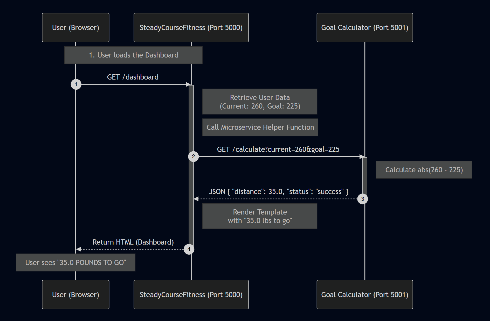

# Goal Calculator Microservice

This microservice provides a lightweight utility to calculate the absolute "distance" between a current value and a target goal. It is designed to be universally applicable for tracking progress in various contexts, such as weight loss (lbs), financial savings ($), or video game experience points (XP).

It creates a dedicated HTTP endpoint that accepts two numbers and returns the calculated difference, handling both positive and negative directions (e.g., losing weight vs. gaining muscle) automatically.

## Communication Contract

### 1. How to Programmatically REQUEST Data

To request a calculation, your program needs to send an **HTTP GET Request** to the microservice's `/calculate` endpoint.

* **URL:** `http://localhost:5001/calculate`
* **Method:** `GET`
* **Parameters:**
  * `current` (float): The user's current starting number.
  * `goal` (float): The user's desired target number.

#### Example Call (Python)

Here is how you would write code to call this service from another Python application:

```python
import requests

# 1. Define the URL and the data you want to send
url = "http://localhost:5001/calculate"
params = {
    "current": 260.5,
    "goal": 225.0
}

# 2. Programmatically send the GET request
try:
    response = requests.get(url, params=params)
    response.raise_for_status() # Check for HTTP errors
except requests.exceptions.RequestException as e:
    print(f"Error calling service: {e}")
```

## 2. How to Programmatically RECEIVE Data

The microservice responds with a JSON Object. To receive the data, your program must parse this JSON response and extract the `distance` field.

* **Response Format:** `JSON`
* **Key Field:** `distance` (float) - The absolute difference between the two numbers.

#### Example Call (Python)

Continuing from the request example above, here is how to extract and use the data:

```python
... (Assuming 'response' is the object from the request above)

if response.status_code == 200:
    # 1. Parse the JSON response
    data = response.json()
    
    # 2. Extract the specific data you need
    distance_remaining = data.get("distance")
    
    # 3. Use the data in your app
    print(f"You have {distance_remaining} units left to go!") 
    # Output: You have 35.5 units left to go!
else:
    print("Failed to calculate distance.")
```

## 3. UML Sequence Diagram


